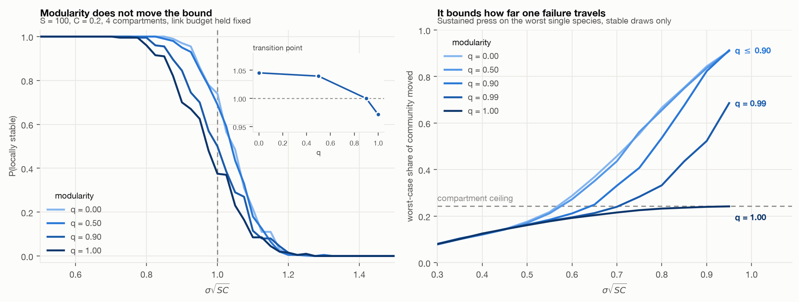

# Does a community walk itself to the edge of stability?

**Yes, and it needs no help.** A community that grows its own complexity, one arriving
species at a time, drives its leading eigenvalue from 0.84 of the bulk spectrum down to
0.03 of it. Every interaction strength tested converges on the same endpoint while
reaching very different complexities. Nothing tunes the system toward the boundary. The
largest cascade a single new arrival can trigger grows alongside it.


**Compartmentalizing does not move that boundary, and this was already known.** At a
fixed link budget, walls do not raise the stability threshold. Grilli, Rogers and
Allesina (2016) proved that analytically. What compartments do instead is cap the reach
of a failure: at the same distance to the boundary, the worst single perturbation moves
99% of an integrated community and 24% of a fully compartmentalized one, which is exactly
the share inside one compartment. That cap is graded, and it weakens as the system
approaches criticality.



Sections 1 to 3 are the random-matrix work, which is largely a reproduction and a
falsification. Section 4 is the assembly experiment, which is where anything new is.

## Why this matters

The Maintenance Thesis predicts that at equal complexity, modular systems outlast
integrated ones (P4). Under local stability that is false, and it was already known to
be false. What survives is weaker and more specific: modularity caps failure size at
roughly 1/m without touching failure probability, which collapses P3 and P4 into a
single prediction rather than two. It also protects least where protection matters
most, since the containment advantage is small far from the boundary and the walls
leak as the system approaches its own limit.

## The model

May's original community matrix. `S` species, `-d` on the diagonal, off-diagonal
entries nonzero with probability `C` and drawn from `N(0, sigma^2)`, with `A_ij`
and `A_ji` drawn independently. The system is locally stable iff every eigenvalue
has negative real part, which for large `S` happens iff `sigma*sqrt(SC) < d`.

The extension adds `m` compartments and a modularity knob `q`:

| `q` | within-compartment | between-compartment | links across walls |
|---|---|---|---|
| 0.00 | C | C | ~1500 |
| 0.50 | 2.1C | 0.5C | ~750 |
| 0.90 | 3.7C | 0.02C | ~150 |
| 0.99 | 4.1C | 0.002C | ~15 |
| 1.00 | 4.1C | 0 | 0 |

`q` redistributes links inward while holding the **expected total link count
constant**. That constraint is what makes this a test of structure rather than a
restatement of May's result that fewer links are more stable.

## Results

All numbers from seed `20260918`. `python run.py` reproduces them exactly.

### 1. The bound reproduces

Transition point (where P(stable) crosses 0.5) against system size, predicted at 1:

| S | transition |
|---|---|
| 50 | 1.092 |
| 100 | 1.036 |
| 200 | 1.026 |

Converging on 1 from above as finite-size effects shrink. ([figure](figures/fig1_may_bound.png))

### 2. Compartments do not move the threshold

Same sweep, `S = 100`, four compartments, link budget fixed:

| modularity `q` | transition |
|---|---|
| 0.00 | 1.045 |
| 0.50 | 1.040 |
| 0.90 | 1.000 |
| 1.00 | 0.972 |

This follows from the construction, and saying so is the honest framing. Packing the
same links into smaller blocks raises within-block density by exactly enough to cancel
the size reduction, so `sigma*sqrt(S_b C_w)` is invariant and the eigenvalue disk keeps
its radius. The spectra show it directly. ([figure](figures/fig3_spectra.png))

The shortfall at `q = 1` is not a separate finding. It is an extreme-value effect: four
independent blocks are all stable with probability `p^4`, so the aggregate curve crosses
0.5 where each block is at `p = 0.841`, which is earlier. Tested directly, a single block
of 25 species at the rescaled connectance, raised to the fourth power, predicts a
transition at 0.981 against a measured 0.978, with mean absolute error 0.009 across the
sweep. ([figure](figures/fig5_extreme_value.png))

### 3. Compartments cap the reach of a failure, and the cap is graded

Worst-case share of the community moved by a sustained press on one species, compared
at **matched distance to the stability boundary** rather than at matched
`sigma*sqrt(SC)`, because conditioning on stable draws is a stronger filter at high `q`
and would otherwise bias the comparison:

| leading Re(λ) | q = 0.00 | q = 0.50 | q = 0.99 | q = 1.00 |
|---|---|---|---|---|
| -0.50 | 0.211 | 0.198 | 0.157 | 0.156 |
| -0.20 | 0.718 | 0.701 | 0.312 | 0.229 |
| -0.07 | 0.943 | 0.940 | 0.581 | 0.240 |
| -0.01 | 0.991 | 0.992 | 0.813 | 0.242 |

Three things read off this. Far from the boundary, structure barely matters. Only
`q = 1` gives a hard cap, and it is exact rather than statistical, because `-A^-1` is
block diagonal and damage cannot leave the compartment it started in. And the
containment advantage of partial separation is real but **degrades as the system
approaches criticality**: `q = 0.99` holds damage to 31% at a comfortable margin and
loses it to 81% at the edge. ([figure](figures/fig4_correction.png))

An earlier version of this README claimed containment was all-or-nothing, on the basis
that `q = 0.99` tracked the compartment ceiling and then left it. That was an artefact
of the detection threshold. At a threshold of 0.01 rather than 0.10, `q = 0.99` sits
above the ceiling at every point in the sweep. The mechanism is gain, not connectivity:
one cross link makes the inverse dense, so influence always reaches everywhere, and what
changes near the boundary is magnitude, since `||A^-1||` diverges as the leading
eigenvalue approaches zero. There is no percolation threshold between `q = 0.99` and
`q = 1.00` to locate. The only structural discontinuity is at exactly zero cross links.

### 4. Grown, not drawn: complexity walks itself to the edge

Everything above uses a matrix that was drawn. This section grows one. Species arrive
one at a time from a fixed pool under generalized Lotka-Volterra dynamics, the community
is re-solved to its saturated equilibrium after each arrival, and anything that cannot
hold a positive abundance is dropped. Nothing tunes the system toward the boundary.


**The community drives its own leading eigenvalue to zero.** Reported scale-free, as the
ratio of the leading real part to the bulk of the Jacobian spectrum, because abundances
change during assembly and the raw eigenvalue would drift toward zero for reasons that
have nothing to do with stability:

| interaction spread | ratio at richness ~12 | at maximum richness | richness reached |
|---|---|---|---|
| 0.6 | 0.835 | 0.035 | 373 |
| 0.9 | 0.756 | 0.025 | 309 |
| 1.2 | 0.648 | 0.028 | 231 |
| 1.5 | 0.624 | 0.037 | 151 |

Every value of sigma converges on the same endpoint, near 0.03, while reaching very
different complexities. Communities trade richness against interaction strength and
arrive at the same distance from their own boundary either way.

**Large failures grow with complexity (P3).** The largest cascade triggered by a single
arrival rises with richness at every sigma, from 0 to 2 at sigma = 0.6 and from 0 to 10
at sigma = 1.5. This is the one Maintenance Thesis prediction that survives intact.

**Assembly does not raise reach (negative result).** Worst-case press spread rises
steeply with richness, from 0.26 to 0.56 at sigma = 1.2. But the same number of species
drawn at random from the same pool gives the same reach, and usually slightly more. The
propagation scale rises with complexity as a size effect, not because assembly selects
for far-reaching structure. The interesting version of this claim is the one that failed.

### What this does to the thesis

The Maintenance Thesis stipulates three ingredients: benefit levels off, maintenance cost
grows faster than linearly, and coupling rises with complexity. The assembly model has
none of them. There is no maintenance cost in it at all. It still drives itself to
marginal stability, which means the thesis is over-specified: the mechanism is simpler
and more general than the one it proposes, and inserting a cost function to produce
collapse would be assuming the conclusion.

Total abundance is sublinear in richness at sigma = 0.6 and superlinear at sigma >= 0.9,
so P1 is parameter-dependent rather than a fact about complex systems, and total
abundance is a weak proxy for benefit in any case.

### What this does to *Destructive Potential*

Equation (7) gives `E = ς · [Φ_E + Tσ̇] · [1 + λ⁺max]` with `λ⁺ = max(λmax, 0)`. Two
things follow from the assembly result.

First, `λ⁺` is exactly 0 throughout the stable regime, so the amplification factor is
pinned at exactly 1 everywhere below criticality. Theorem 3.3 concludes that E is
minimised at the edge of chaos from that factor being approximately 1, but it is exactly
1 across the whole stable region and therefore cannot discriminate between the edge and
anywhere else.

Second, ς rises with complexity while the system drives itself toward the point where
`λ⁺` stops being 0. So E rises with complexity through the propagation scale, and the
system parks itself exactly where the amplification factor is about to start growing.
The note's earlier diagnosis was that Processism needs a maintenance cost term that rises
with C. It may not. ς already rises with C, and the papers simply never let it vary.

## Limits

- **Nothing here complexifies.** The matrix is drawn, not grown. This model cannot test
  the claim that complexification generates its own fragility, because no complexity is
  generated. Testing that needs assembly: species arriving one at a time, the community
  keeping what persists, and a check on whether it walks itself toward the boundary
  rather than being placed near it. Bunin (2017) and Biroli, Bunin and Cammarota (2018)
  are the place to start, since both find phases where equilibria sit marginally stable.
- **Local stability only.** Linear stability at a fixed point, not persistence under
  nonlinear dynamics. Stouffer and Bascompte (2011) measured persistence in dynamical
  food-web models. This result does not contradict them. It shows the local-stability
  route does not reproduce their conclusion, so whatever drives it is dynamical.
- **No sign structure.** `A_ij` and `A_ji` are independent, so there are no
  predator-prey pairs. Allesina and Tang (2012) showed sign structure moves the bound
  substantially.
- **The spread measure carries a threshold.** "Moved" means a response at least 10% of
  the pressed species' own response. The absolute numbers depend on that choice, as
  section 3 shows. The ordering across `q` does not.
- **Uniform self-regulation, one size.** Every species gets the same `d`, and
  experiments 2 and 3 use `S = 100`, `m = 4` only.
- **Assembly finds the saturated equilibrium, not the dynamical attractor.** Section 4
  solves for equilibrium by iterative removal rather than integrating the ODEs. That is
  the standard construction and it is fast, but it assumes the community settles to that
  equilibrium rather than to a limit cycle or a chaotic attractor.
- **The high-richness bins saturate the pool.** Mean cascade size falls in the last bin
  at sigma = 0.9 and 1.2 because few uninvaded species remain, not because cascades
  became rarer. Maximum cascade size is the measure to read there.

## Next

1. **Integrate the ODEs for a subset of assembly histories** to check that the saturated
   equilibrium is where the dynamics actually go.
2. **Sweep `m` and measure what small compartments cost.** Capping damage at 1/m has to
   cost something, or every system would be maximally compartmentalized. Finding that
   cost is what would turn this from an observation into a law, and it is the most
   valuable experiment left.
3. **Test the criticality dependence properly.** The prediction is that the apparent
   containment threshold moves with the detection threshold and with distance to the
   bound, and that it is a statement about gain rather than structure.
4. **Repeat result 2 with predator-prey sign structure** (Allesina & Tang 2012), which
   may change the answer.
5. **Vary the arrival process.** Every result in section 4 uses random arrival order.
   Whether ordered or adversarial invasion changes the endpoint is untested.

## Running it

```bash
python -m venv .venv && .venv/bin/pip install -r requirements.txt
.venv/bin/python run.py             # ~3 min, writes results/*.json
.venv/bin/python critique_check.py  # the three checks behind sections 2 and 3
.venv/bin/python run_assembly.py    # section 4, ~1 min
.venv/bin/python controls.py        # the two controls behind section 4
.venv/bin/python figures.py         # redraws figures/ from saved results
```

`may.py` and `assembly.py` are the two models and their measures. `run.py`,
`critique_check.py`, `run_assembly.py` and `controls.py` are the experiments.
`figures.py` only draws.

## References

Allesina, S. & Tang, S. (2012). Stability criteria for complex ecosystems. *Nature* 483, 205-208.
Bender, E. A., Case, T. J. & Gilpin, M. E. (1984). Perturbation experiments in community ecology. *Ecology* 65, 1-13.
Biroli, G., Bunin, G. & Cammarota, C. (2018). Marginally stable equilibria in critical ecosystems. *New J. Phys.* 20, 083051.
Bunin, G. (2017). Ecological communities with Lotka-Volterra dynamics. *Phys. Rev. E* 95, 042414.
Grilli, J., Rogers, T. & Allesina, S. (2016). Modularity and stability in ecological communities. *Nat. Commun.* 7, 12031.
May, R. M. (1972). Will a large complex system be stable? *Nature* 238, 413-414.
McCann, K. S. (2000). The diversity-stability debate. *Nature* 405, 228-233.
Stouffer, D. B. & Bascompte, J. (2011). Compartmentalization increases food-web persistence. *PNAS* 108, 3648-3652.
