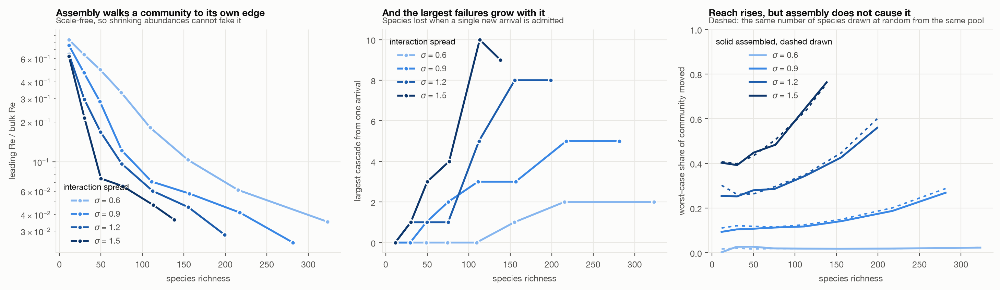

# 02. Grown communities

Does a community that grows its own complexity walk itself to the edge of stability?

**Headline: yes, and it needs no help.** The scale-free distance to the stability
boundary falls from 0.84 to 0.03 as the community assembles. Every interaction strength
tested converges on the same endpoint while reaching very different complexities.
Nothing tunes the system toward the boundary.



## This reproduces a known result

Biroli, Bunin and Cammarota (2018) established that these systems self-adapt to remain
marginally stable, shedding species until they saturate May's bound, and that this emerges
from the dynamics rather than being imposed. The convergence reported below, where every
interaction strength reaches the same scale-free distance from the boundary while reaching
different richness, is that same statement seen from a different angle: saturating the
bound is what makes the endpoint independent of sigma.

So the mechanism here is real and it is not new. What the reproduction buys is a validated
instrument and one argument that the original papers do not make, in the common-cause
section below. Whether the *graded containment* result in
[experiment 01](../01-random-matrix/) is novel has not been checked against Grilli et al.
(2016) in detail, and should not be assumed either way.

## The model

Generalized Lotka-Volterra, `dN_i/dt = N_i (K_i - sum_j A_ij N_j)` with `A_ii = 1`.
Species arrive one at a time from a fixed pool. After each arrival the community
re-solves to its saturated equilibrium by iterative removal, and anything that cannot
hold a positive abundance is dropped.

**The community drives its own leading eigenvalue to zero.** Reported scale-free, as the
ratio of the leading real part to the bulk of the Jacobian spectrum, because abundances
change during assembly and the raw eigenvalue would drift toward zero for reasons that
have nothing to do with stability:

| interaction spread | ratio at richness ~12 | at maximum richness | richness reached |
|---|---|---|---|
| 0.6 | 0.835 | 0.035 | 373 |
| 0.9 | 0.756 | 0.025 | 309 |
| 1.2 | 0.648 | 0.028 | 231 |
| 1.5 | 0.624 | 0.037 | 151 |

Every value of sigma converges on the same endpoint, near 0.03, while reaching very
different complexities. Communities trade richness against interaction strength and
arrive at the same distance from their own boundary either way.

**Large failures grow with complexity (P3).** The largest cascade triggered by a single
arrival rises with richness at every sigma, from 0 to 2 at sigma = 0.6 and from 0 to 10
at sigma = 1.5. This is the one Maintenance Thesis prediction that survives intact.

**Assembly does not raise reach (negative result).** Worst-case press spread rises
steeply with richness, from 0.26 to 0.56 at sigma = 1.2. But the same number of species
drawn at random from the same pool gives the same reach, and usually slightly more. The
propagation scale rises with complexity as a size effect, not because assembly selects
for far-reaching structure. The interesting version of this claim is the one that failed.

## What this does to the thesis

The Maintenance Thesis stipulates three ingredients: benefit levels off, maintenance cost
grows faster than linearly, and coupling rises with complexity. The assembly model has
none of them. There is no maintenance cost in it at all. It still drives itself to
marginal stability, which means the thesis is over-specified: the mechanism is simpler
and more general than the one it proposes, and inserting a cost function to produce
collapse would be assuming the conclusion.

Total abundance is sublinear in richness at sigma = 0.6 and superlinear at sigma >= 0.9,
so P1 is parameter-dependent rather than a fact about complex systems, and total
abundance is a weak proxy for benefit in any case.

## What this does to *Destructive Potential*

Equation (7) gives `E = ς · [Φ_E + Tσ̇] · [1 + λ⁺max]` with `λ⁺ = max(λmax, 0)`. Two
things follow from the assembly result.

First, `λ⁺` is exactly 0 throughout the stable regime, so the amplification factor is
pinned at exactly 1 everywhere below criticality. Theorem 3.3 concludes that E is
minimised at the edge of chaos from that factor being approximately 1, but it is exactly
1 across the whole stable region and therefore cannot discriminate between the edge and
anywhere else.

Second, ς rises with complexity while the system drives itself toward the point where
`λ⁺` stops being 0. So E rises with complexity through the propagation scale, and the
system parks itself exactly where the amplification factor is about to start growing.
The note's earlier diagnosis was that Processism needs a maintenance cost term that rises
with C. It may not. ς already rises with C, and the papers simply never let it vary.

## Limits

- **This finds the saturated equilibrium, not the dynamical attractor.** Equilibrium is
  solved by iterative removal rather than by integrating the ODEs. That is the standard
  construction and it is fast, but it assumes the community settles there rather than to
  a limit cycle or a chaotic attractor. Checking a handful of histories by integration is
  the first thing to do next.
- **The high-richness bins saturate the pool.** Mean cascade size falls in the last bin
  at sigma = 0.9 and 1.2 because few uninvaded species remain, not because cascades
  became rarer. Maximum cascade size is the measure to read there.
- **Random arrival order only.** Whether ordered or adversarial invasion changes the
  endpoint is untested.
- **Competition only, one pool size.** `mu = 0.5`, pool of 400.

## Running it

```bash
python run_assembly.py  # the sweep, ~1 min, writes results/
python controls.py      # the two controls: abundance scaling, and the matched null
python probe.py         # the initial parameter scan that set the sweep range
python figures.py       # redraws figures/ from saved results
```
