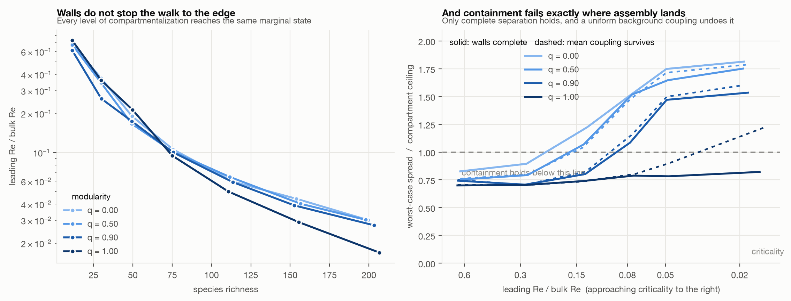

# 03. Grown into compartments

Do the mechanisms from experiments 01 and 02 interact? Specifically: does containment
still work at the endpoint assembly picks for itself?

**Headline: no. Compartments do not stop a community reaching criticality, and at the
state it reaches, containment has already failed.** Only complete separation holds, and
even that fails if any uniform background coupling survives the walls.



## Why this experiment exists

[Experiment 01](../01-random-matrix/) found that containment weakens as a system nears
criticality. [Experiment 02](../02-assembly/) found that a system growing its own
complexity arrives at criticality unprompted. Those used different models, so the obvious
joint claim could not be tested. This runs both mechanisms in one model.

The prediction going in, stated in the top-level README before this ran, was that partial
compartmentalization would buy nothing at the assembly endpoint and only complete
decoupling would hold.

## The model

[Experiment 02](../02-assembly/)'s assembly, with the pool given `m = 4` compartments and
a modularity knob `q` that redistributes interaction variance inward while holding the
total fixed. This is the same budget constraint used in experiment 01, carried over from
the drawn model to the grown one.

Two variants, and the difference between them turned out to matter:

- **Walls complete.** Both the mean and the variance of the interaction respect the
  compartment boundary, so `q = 1` leaves the compartments genuinely independent.
- **Mean coupling survives.** Walls block the fluctuating part of the interaction, but
  every pair keeps the same small mean coupling `mu/S = 0.00125` whatever `q` says. This
  is the realistic case: real barriers are usually built against variable interactions
  while a uniform background persists.

## Results

### Compartments do not stop the walk to criticality

Scale-free distance to the boundary, by richness:

| `q` | richness ~12 | ~205 |
|---|---|---|
| 0.00 | 0.679 | 0.030 |
| 0.50 | 0.678 | 0.030 |
| 0.90 | 0.612 | 0.028 |
| 1.00 | 0.730 | 0.017 |

Every level of compartmentalization arrives at the same marginal state. Whatever walls
buy, it is not protection from criticality itself.

### And containment has already failed when it gets there

Worst-case spread as a multiple of its own compartment ceiling. Above 1 means damage has
escaped the compartment it started in:

| `q` | far from boundary | at criticality |
|---|---|---|
| 0.00 | 0.83 | 1.85 |
| 0.50 | 0.74 | 1.78 |
| 0.90 | 0.73 | 1.52 |
| 1.00 | 0.70 | **0.81** |
| 1.00, mean coupling survives | 0.72 | **1.22** |

Far from the boundary every level of compartmentalization contains damage. At the
endpoint assembly selects, only complete separation still does. Partial
compartmentalization reduces spread, from 1.85 to 1.52 ceilings at `q = 0.9`, but
reducing is not containing.

**The last row is the one worth dwelling on.** A uniform coupling of 0.00125 per pair,
with one hundred percent of the interaction variance moved inside the compartments, is
enough to break containment at criticality. Walls have to stop everything, not just the
variable part.

## What this settles

The joint claim stated in the top-level README, which neither earlier experiment could
test, now has a direct test in a single model and it survived it:

> Modularity's protection fails precisely at the state that assembly selects for.

With a strengthening that was not predicted: complete separation of the fluctuating
interactions is not sufficient. Any surviving uniform coupling reopens the compartment.

## Limits

- **One model class.** Everything here is generalized Lotka-Volterra, so this establishes
  that the two mechanisms interact in that substrate, not that they interact generally.
  That is [experiment 04](../).
- **A bug is in the history, deliberately.** The first run of this experiment coupled the
  compartments through the mean without intending to, which produced a `q = 1` spread of
  1.22 ceilings where complete decoupling makes anything above 1 impossible. The
  impossibility is what exposed it. The variant is kept because it turned out to be the
  more realistic model.
- **Inherits experiment 02's limits**, including that this finds the saturated
  equilibrium rather than integrating the dynamics.
- `m = 4`, `sigma = 1.2`, pool of 400, five replicates per level.

## Running it

```bash
python run_03.py                  # walls complete
COUPLE_MEAN=1 python run_03.py    # uniform mean coupling survives the walls
python figures.py
```
