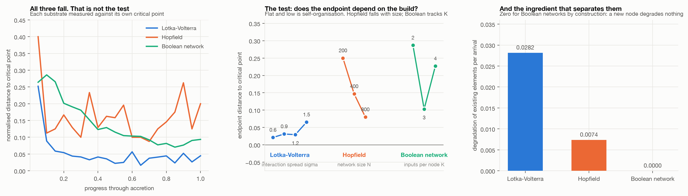

# 04. Is this complexification, or is it ecology?

Does accretion drive a system to its own critical point regardless of what the system is
made of? This is the experiment that decides whether "structurally" is earned.

**Headline: two of three substrates, and the one that fails identifies why.** Communities
and associative memories, which share no mathematics, both drive themselves to the edge.
Boolean networks do not. What separates them is whether a new element degrades the
elements already present.



## The design rule

**The viability filter must never be a stability filter.** In the ecological model the
filter is "a species that cannot hold a positive abundance is dropped", which is about
feasibility, and marginal stability then emerges. A substrate whose filter said "stay
stable" would assume the conclusion, which is the trap this programme has fallen into
before.

So all three filters are about function, and none of them knows where its substrate's
critical point is:

| Substrate | Element | Filter | Critical point |
|---|---|---|---|
| Lotka-Volterra | species | cannot hold positive abundance | leading eigenvalue reaches zero |
| Hopfield | memory | can no longer be recalled | worst memory reaches the recall threshold |
| Boolean network | node | has stopped computing anything | average sensitivity `s = 1` |

Hopfield's margin uses the **worst** retained memory, not the mean, because the ecological
margin uses the leading eigenvalue rather than the bulk. Using the mean understates it
badly: at the endpoint the mean overlap is a comfortable 0.977 while the worst memory sits
on the threshold.

## The test

Every substrate's margin falls during accretion, and that on its own proves nothing. The
test is whether **the endpoint is independent of what the system was built from.** A
system that self-organises to criticality arrives there whatever its parameters. A system
that merely sits where its parameters put it shows endpoints that track them.

| Substrate | Parameter | Endpoint margins | Reading |
|---|---|---|---|
| Lotka-Volterra | sigma = 0.6, 0.9, 1.2, 1.5 | 0.021, 0.031, 0.029, 0.065 | **Converges.** Flat and low across a 2.5x range |
| Hopfield | N = 200, 400, 800 | 0.250, 0.147, 0.080 | **Converges**, with finite-size corrections |
| Boolean network | K = 2, 3, 4 | 0.287, 0.103, 0.227 | **Does not.** Tracks K |

Hopfield needs care and the automated verdict got it wrong. Its endpoints are not
scattered, they fall monotonically with network size as roughly `N^-0.82` and extrapolate
to zero. That is the same finite-size convergence seen in
[experiment 01](../01-random-matrix/), where May's bound was located at 1.092, 1.036 and
1.026 for growing `S`. The Boolean network is genuinely different: its endpoint is
U-shaped in `K`, and it lands near criticality at `K = 3` only because random `K = 3`
networks *start* near `s = 1`.

## What separates them

Interference: how much one arrival degrades what is already there.

| Substrate | Degradation per arrival |
|---|---|
| Lotka-Volterra | 0.0282 |
| Hopfield | 0.0074 |
| Boolean network | **0.0000** |

Species draw on finite carrying capacity and memories are written into the same finite set
of weights, so in both cases a newcomer takes something from the incumbents. A Boolean
node takes nothing: adding it leaves every existing node's inputs and truth table
untouched, so the zero is exact rather than measured.

The two substrates where arrival is costly converge. The one where arrival is free does
not. That is one contrast across three substrates, not a demonstration, but it is a
mechanism with a sharp edge:

> **Accretion drives a system to its own critical point when new elements degrade
> existing ones, and not otherwise.**

That is a cross-domain statement formal enough to fail, and the way to fail it is
specific: find a substrate with interference that does not converge, or one without
interference that does.

## What this does to "structurally"

The word is partly earned and should be stated at the strength the evidence supports.

**Earned:** the phenomenon is not an artefact of ecology. Hopfield networks share no
mechanism with Lotka-Volterra, having discrete states, an energy function, no dynamics in
continuous time and no interaction matrix whose eigenvalues decide anything, and they show
it anyway.

**Not earned:** universality. Accretion alone does not do it. A substrate needs
interference, and whether interference is sufficient rather than merely necessary is
untested.

So the defensible claim is narrower than the thesis wants and more useful than the thesis
had: complexification drives systems to marginality **wherever complexity is built from
elements that compete for something finite.** Whether the universe is such a system is not
a question this repository can answer.

## Limits

- **Three substrates is not many**, and one contrast is carrying the whole mechanistic
  claim. Interference is a hypothesis here, not an established cause.
- **Hopfield's convergence is an extrapolation.** N = 200, 400, 800 fall as `N^-0.82`, but
  the largest network tested still sits at 0.080 rather than 0.
- **The Boolean filter may simply be the wrong one.** Removing frozen nodes is a
  functional filter as required, but a different functional filter might converge. A
  negative result for one filter is not a negative result for the substrate.
- **Interference is measured differently in each substrate** because "degradation" means
  something different in each, so the magnitudes are not strictly comparable. Only the
  contrast between nonzero and exactly zero carries weight.

## Running it

```bash
python run_04.py   # trajectories, the parameter sweep, and interference, ~3 min
python figures.py
```
