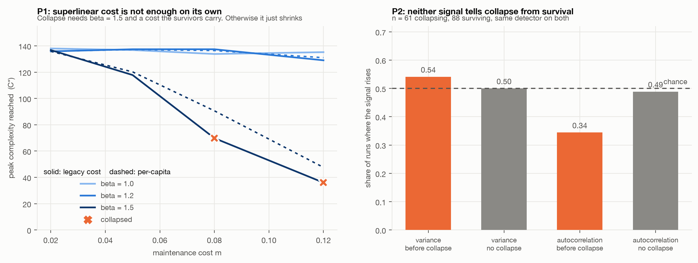

# 05. The maintenance cost, and whether anything warns you

The two predictions that had stood untested since the start. P1 says maintenance cost
growing faster than linearly produces a threshold `C*` past which the system comes apart.
P2 says variance and autocorrelation rise before collapse. P2 needs collapses, which is
why it waited for P1.

**Headline: P1 holds only under a much narrower condition than stated, and P2 is false in
this model.** Neither early-warning signal tells a collapsing system from a surviving one.



## P1: superlinear cost is not sufficient

Two ways for cost to scale, and they behave nothing alike:

- **Per-capita.** Everyone pays a share that grows with richness, `K_eff = K0 - m*S^(b-1)`.
- **Legacy.** The cost is of what has already been built and falls on whoever is left,
  `K_eff = K0 - m*S_peak^b / S`. Losing a member raises the burden on the survivors. This
  is Tainter's mechanism, and the only one of the two that can run away.

Peak complexity reached, and whether the run ended in collapse:

| cost | `beta` | m = 0.02 | 0.05 | 0.08 | 0.12 |
|---|---|---|---|---|---|
| per-capita | 1.0 | 138 | 137 | 134 | 135 |
| per-capita | 1.2 | 136 | 137 | 136 | 131 |
| per-capita | 1.5 | 136 | 120 | 91 | 48 |
| legacy | 1.0 | 138 | 137 | 134 | 135 |
| legacy | 1.2 | 136 | 137 | 137 | 129 |
| legacy | 1.5 | 137 | 118 | **70, collapse** | **36, collapse** |

Superlinear cost on its own produces smooth shrinkage, never collapse: the per-capita row
at `beta = 1.5` falls 136, 120, 91, 48 without ever coming apart. Legacy structure on its
own produces nothing at all, because `beta = 1.0` and `beta = 1.2` collapse at no cost
level tested. **Collapse needs both**, and then `C*` is real and depends on the cost: 70
at `m = 0.08`, 36 at `m = 0.12`.

The original working note half anticipated this, observing that the smooth equation
"produces gradual decline, never collapse" and that an abrupt fall "needs a feedback that
removes capacity as C rises". The legacy mode is that feedback, built and confirmed. What
the note did not say, and what P1 as written gets wrong, is that the superlinear exponent
is not the operative ingredient. **The direction the cost falls is.**

## P2: neither signal warns you

There was a prior worth stating before the numbers came in. [Experiment 02](../02-assembly/)
showed these systems sit permanently at marginal stability, and critical slowing down is
precisely what early-warning signals detect. A system always at the edge has a leading
eigenvalue always near zero, so it always recovers slowly, so the signal has no headroom
left to rise. That makes the **false positive rate the real test**, not the true positive
rate.

Same detector run on both, scoring the Kendall trend of each signal over the 120 steps
before the run ends:

| Signal | Rises before collapse | Rises without collapse | Discrimination |
|---|---|---|---|
| Variance | 0.54 | 0.50 | **+0.04** |
| Autocorrelation | 0.34 | 0.49 | **-0.14** |

Variance is at chance. Autocorrelation is worse than chance: it rises *less* often before
collapse than in runs that never collapse. n = 61 collapsing, 88 surviving.

P2 is falsified here, and the mechanism for the failure is the one predicted. The
canonical critical-slowing-down indicator carries no information in a system that is
permanently critical, because there is nothing for it to slow down *from*.

## Two methodological notes, both of which nearly produced wrong answers

**The first version of the model was inert.** The Lotka-Volterra equilibrium solves
`A N = K`, so scaling `K` uniformly rescales every abundance and leaves the composition
exactly unchanged. Feasibility is scale-invariant. Expressing a maintenance cost as a
reduction in `K` therefore changes nothing, and the first run returned identical richness
at every cost and every exponent, which is how the error announced itself. The cost bites
only once something breaks that invariance, here a minimum viable abundance.

**The first P2 sample said the opposite of the real answer.** With 12 collapsing runs,
variance rose in 0.75 of collapses against 0.31 of survivals, which looks like a strong
signal. At n = 61 it is 0.54 against 0.50. The small-sample version was noise, and it is
worth naming because that is the shape of the replication problem the early-warning
literature has had.

## Limits

- **One model.** P2's failure is a statement about assembled Lotka-Volterra communities
  sitting at marginality, not about early-warning signals in general. In a system that
  spends most of its life well away from a boundary, the signals may work exactly as
  advertised. That is the interesting boundary condition and it is untested here.
- **One state variable.** Total abundance. Other observables might carry signal that this
  one does not.
- **Collapse here is total.** The community goes to zero rather than to a smaller
  alternative state, so this is not a test of early warning for a regime shift between two
  stable states, which is the case Scheffer's work is usually about.
- **The detector is the standard one**, rolling window of 40 with linear detrending, but no
  attempt was made to tune it. A better detector might do better.

## Running it

```bash
python run_05.py     # the P1 grid and a first pass at P2, ~1 min
python p2_power.py   # the larger P2 sample that overturned the first pass
python figures.py
```
